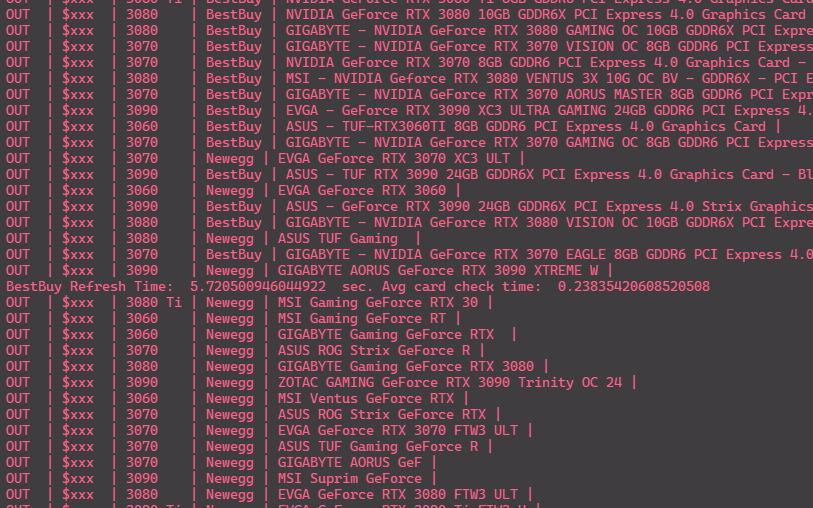

# Simple Quick GPU Bot
Definitely not my custom made web scraper bot for buying an RTX 3080. Nope definitely not that. 

[](https://github.com/kysu1313/Quick-GPU-Bot/LICENSEs)[]()  [](https://github.com/kysu1313/Quick-GPU-Bot/issues)  [](https://github.com/sindresorhus/awesome)  


__QUICK SETUP__:
1. If using Chrome (_Recommended_):
    Download ChromeDriver from (https://chromedriver.chromium.org/downloads) and add the .exe path to the "custom_chrome_exe_path" in settings.json
2. If using FireFox:
    Download GeckoDriver from here: (https://github.com/mozilla/geckodriver/releases)  and add it to your PATH environment variables.
3. Add your preferences, shipping, payment and site log-in information to the 'settings.json' file.
  *Note: The important setting fields are denoted by a smily face emoji.
5. Install requirements from requirements.txt with ```pip install -r requirements.txt```
6. If you want to use this bot and have it text you when it gets a hit. You will need to make a developer account on Twilio (https://www.twilio.com/docs/iam/keys/api-key) and add your private keys to the mssage.py class.
  Like this:
  ```CLIENT = Client("Account SID", "Auth Token")```
    You can disable messaging in the settings file if you want.
6. To Run: ```py app.py``` in the command line

"Demo with console output:"


SUPPORT:
- Currently supports Firefox and Chrome browser drivers
- ** Only supports BestBuy and Newegg ** However B&H Photo and Amazon are in the works.

NOTES:
- If you run the bot using headless mode, when the 2-factor auth is required from newegg on startup, a small tkinter textbox will popup. Just submit your 2FA code there and the program will continue. 
- 'DEBUG_MODE' must be set to 'True' for any of the debug settings to take effect.
- You can add custom url's to the 'URLs' section in the settings.json file
- If you are getting "selenium.common.exceptions.WebDriverException: Message: '<your-chrome-driver-path-here>' executable needs to be in PATH." You just need to add the chrome driver path to the settings.json file field named "custom_chrome_exe_path"


